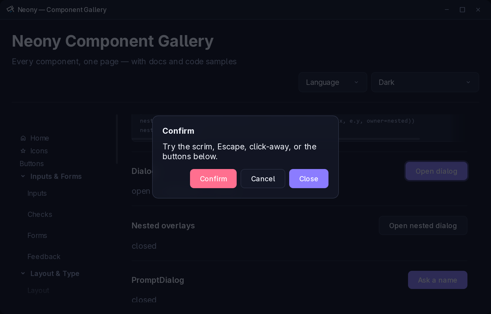
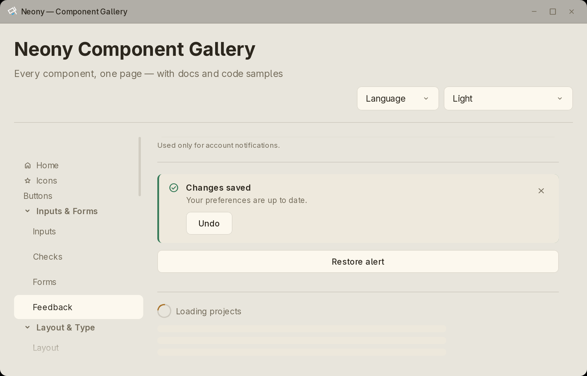
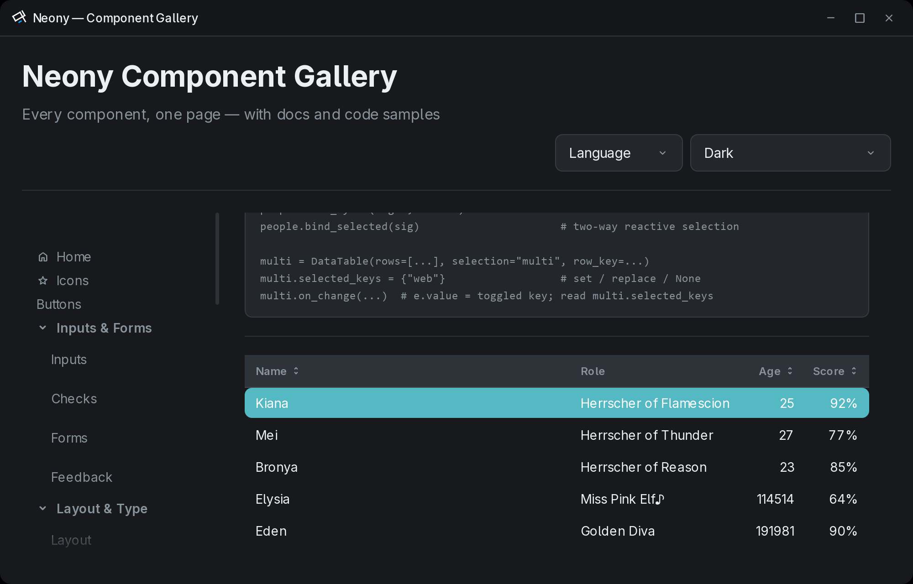
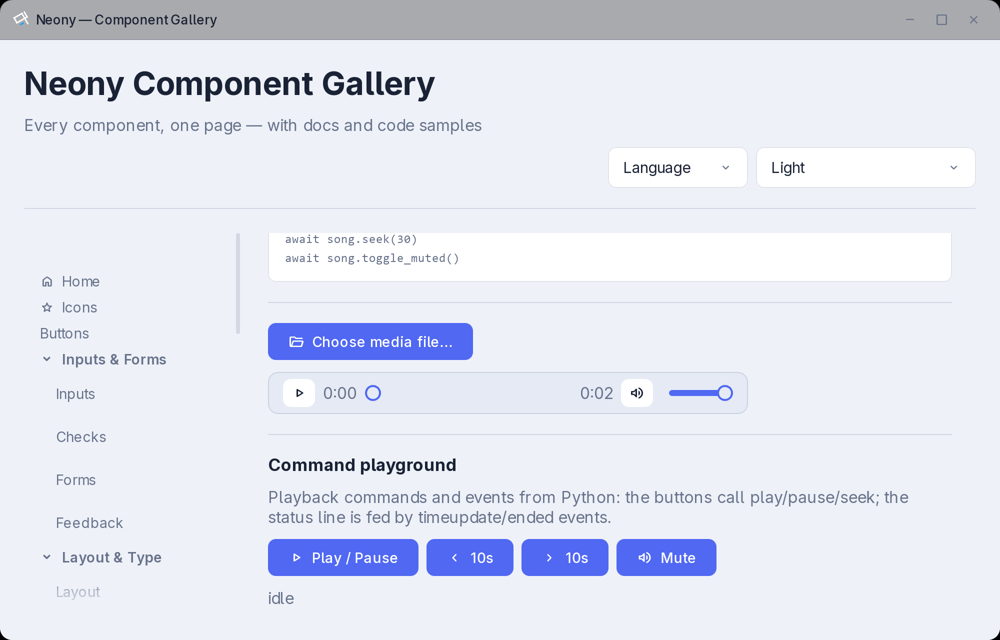

# 截图展示

> [English version](showcase.en.md) · [文档首页](README.zh.md)

这些截图来自真实运行在原生窗口中的 `neony.gallery` 应用，不是概念图，也不是
另外渲染的网页。每张图片使用不同的内置主题族，展示同一批组件如何响应主题
令牌。

在仓库中运行同一个应用：

```bash
uv run gallery
```

## 浮层生命周期



Cyberangel Dark。Dialog、Menu、Dropdown、Tooltip 与 Toast 共用当前窗口的
层级管理器。从已有浮层中打开的浮层会获得自己的逻辑栈位置，因此 Escape 与
点击外部事件会送达正确的组件。

## 反馈与表单



Ember Zone Light。反馈页面组合了 `Textarea`、`FormField`、`Alert`、
`Spinner` 与 `Skeleton`。标签、帮助文本、错误提示和无效状态通过明确的
辅助功能关系连接到控件。

## 虚拟化数据



Nightglow Dark。`DataTable` 在渲染大数据集合的有界窗口时，仍保留固定表头、
排序、行身份和选择语义。

## 受管媒体



Planet Plaza Light。`Audio` 与 `Video` 提供主题化传输控制、`neony://`
本地源、跳转、音量与播放事件，应用代码无需接触原始 HTML 媒体元素。
